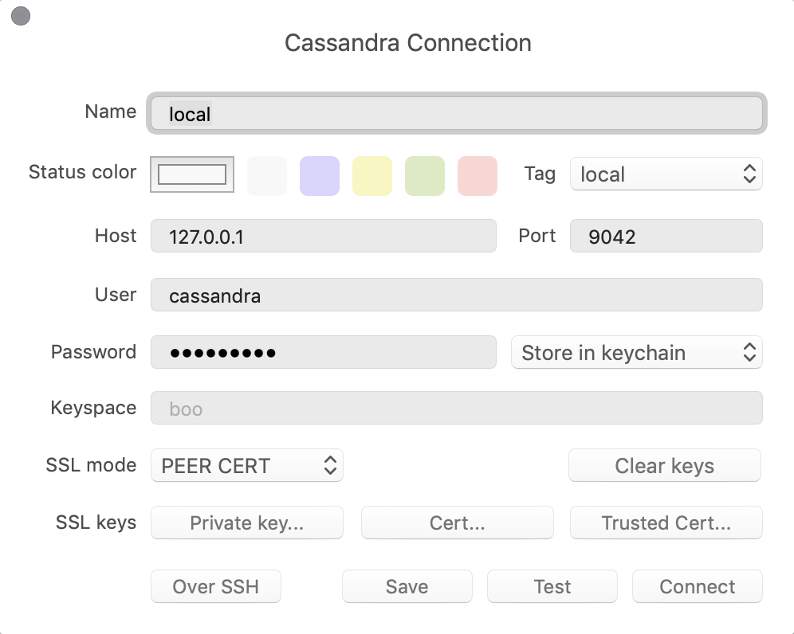

# Prerequisite

1. Install docker

    https://docs.docker.com/install/

  2. Install cassandra
  ```
  docker run --name cassandra -d -p 9042:9042 -e CASSANDRA_PORT_NUMBER=9042 bitnami/cassandra:latest
  ```

  3. Install TablePlus

     https://tableplus.io

  


# Create console app

1. `mix new sample_app`
2. edit `mix.exs` 

 - add xandra to applications
```elixir
def application() do
  [applications: [:logger, :xandra]]
end
```
 - and to deps
```elixir
def deps() do
  [{:xandra, "~> 0.10"}]
end
```
3. cd sample_app and run `mix deps.get`

#### Connect to cassandra

```elixir
{:ok, conn} = Xandra.start_link(nodes: ["127.0.0.1:9042"])
```
#### Create and use keyspace

```elixir
keyspace = "test_keyspace"
Xandra.execute!(conn, "DROP KEYSPACE IF EXISTS #{keyspace}")

statement = """
CREATE KEYSPACE #{keyspace}
WITH replication = {'class' : 'SimpleStrategy', 'replication_factor' : 1}
"""

Xandra.execute!(conn, statement)
{:ok, result} = Xandra.execute(conn, "USE test_keyspace")
```

#### Create table

```elixir
{:ok, result} = Xandra.execute(conn, "CREATE TABLE numbers (figure int PRIMARY KEY)")
```

#### Insert 

```elixir
{:ok, result} = Xandra.execute(conn, "INSERT INTO numbers (figure) VALUES (123)")
```

#### Get

```elixir
{:ok, result} = Xandra.execute(conn, "SELECT * FROM numbers WHERE figure = ?", [{"int", 123}])

{:ok, result} = Xandra.execute(conn, "SELECT * FROM numbers WHERE figure = ?", [{"int", 321}])
```

